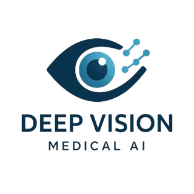

# BioVision™ by DeepVision Technologies



BioVision™ is a cutting-edge medical imaging platform that combines hyperspectral imaging with artificial intelligence to revolutionize wound care diagnosis and management.

## 🎯 Mission

DeepVision builds decision-support tools that bring laboratory-grade insight to the point of care. Our flagship device, **BioVision**, combines hyperspectral imaging with AI to support clinicians in diagnosing and managing chronic wounds more quickly and consistently.

## 🔬 Technology

BioVision captures hundreds of wavelengths and translates them into clinically relevant maps including:

- **Tissue Oxygenation** - Real-time oxygen level mapping
- **Hemoglobin Distribution** - Blood flow visualization 
- **Tissue Hydration** - Moisture content analysis
- **Bacterial Detection** - Suspected bacterial fluorescence highlighting

## ✨ Key Features

- **Portable & Ergonomic**: Bedside-friendly design for clinics, wards, community nursing and home visits
- **3D Wound Topography**: Depth-aware imaging (RGB‑D) to support documentation and healing assessment
- **Real-time Analysis**: Instant clinical insights at the point of care
- **Hyperspectral + AI**: Laboratory-grade analysis in a portable device

## 🏥 Applications

- Chronic wound management
- Bacterial load detection
- Tissue viability assessment
- Healing progress monitoring
- Clinical documentation

## 🚀 Getting Started

This is a Next.js application that serves the BioVision platform website.

### Prerequisites

- Node.js 18+ 
- npm or yarn

### Installation

```bash
# Clone the repository
git clone https://github.com/MuaiadHadad/BioVision.git
cd BioVision

# Install dependencies
npm install

# Run the development server
npm run dev
```

### Build for Production

```bash
# Create production build
npm run build

# Start production server
npm start
```

### Development Commands

```bash
npm run dev      # Start development server
npm run build    # Build for production
npm run start    # Start production server
npm run lint     # Run ESLint
```

## 🏗️ Architecture

This application uses:

- **Next.js 14** - React framework with app router
- **TypeScript** - Type-safe development
- **Bootstrap 5** - UI components and styling
- **Legacy Integration** - Seamless integration with existing HTML/CSS/JS assets

## 📁 Project Structure

```
BioVision/
├── app/                 # Next.js app router
│   ├── page.tsx        # Main page component
│   ├── layout.tsx      # Root layout
│   └── globals.css     # Global styles
├── public/             # Static assets
│   ├── images/         # Images and logos
│   └── legacy/         # Legacy HTML template assets
├── package.json        # Dependencies and scripts
└── README.md          # Project documentation
```

## 🔧 Configuration

The application is configured via:

- `next.config.js` - Next.js configuration
- `tsconfig.json` - TypeScript configuration  
- `package.json` - Dependencies and metadata

## 👥 Team & Partners

BioVision is being developed with academic and healthcare partners to ensure clinical relevance and validation.

**Consortium Partners**: 3  
**R&D Timeline**: 30+ months  
**Target**: 5400+ annotated images for AI training

## 📍 Contact & Location

**DeepVision Technologies**  
Miranda do Corvo Industrial Park  
Portugal  

📧 Email: Geral@deepvision.pt  
📞 Phone: +351 938 929 505

## 📄 License

© 2024 DeepVision Technologies. All rights reserved.

## 🤝 Contributing

Want to see BioVision in action or explore a pilot? Send us a note at Geral@deepvision.pt

---

*Revolutionizing wound care through hyperspectral imaging and artificial intelligence.*
